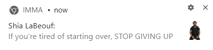

# IMMA

 

* `docs/` contains code for [IMMA's website](https://wflms20110333.github.io/IMMA/)
* `extension/` contains code for the chrome extension (client)
* `server/` contains code for the Flask server
* `server/model/` contains code for the backend Python functions
* `server/requirements.txt` contains list of dependencies (is kept updated by running `pip freeze > server/requirements.txt`)

## Activating the environment

1) Create a new venv if you don't have one yet. Activate the virtual environment with
* `venv_windows_train\Scripts\activate.bat` for Windows
* `source venv/bin/activate` for Mac and Linux

2) Update your virtual environment by running `pip install -r server/requirements.txt` or equivalent within the active environment. Alternatively, run `pip3 install --no-cache-dir -r server/requirements.txt`.

## Running the website

```shell
cd docs
python3 -m http.server
```

## Running the server

Run `python server/app.py` (can use Postman or similar to test requests)

Before the first time you run the server, make sure the path is set correctly:

```shell
export FLASK_APP=server/app.py
```

If debug mode is set to False, after every change, restart the server with

```shell
flask run
```

This will launch the server at `http://127.0.0.1:5000/`.

### Deploying the server

The server is located at <http://ec2-54-201-225-18.us-west-2.compute.amazonaws.com/>.

The system hostname of the server is `server.imma.studio` (<https://docs.aws.amazon.com/AWSEC2/latest/UserGuide/set-hostname.html>).

#### Starting a new EC2 instance (Ubuntu)

Setting up Docker:

```shell
sudo apt-get update
sudo apt-get remove docker docker-engine docker.io
sudo apt install docker.io
sudo systemctl start docker
sudo systemctl enable docker
sudo usermod -a -G docker ubuntu
```

Installing PostgreSQL:
```shell
sudo apt-get install postgresql-client
```

#### Maintaining the current server

SSH into the EC2 instance with

```shell
ssh -i IMMA.pem ubuntu@ec2-54-201-225-18.us-west-2.compute.amazonaws.com
```

The server has been containerized with docker. After changing directories to `server/`,
build the docker file after any changes with

```shell
docker build -t imma:latest .
```

And launch a container with

```shell
docker run -d -p 80:5000 --name imma-server imma
```

* To list all containers: `docker ps -a`
* To stop all containers: `docker stop $(docker ps -aq)`
* To remove all containers: `docker rm $(docker ps -aq)`
* To ssh into a running container: `docker exec -it CONTAINER_NAME /bin/bash`

To exit the SSH session, type `logout`.

### Database instructions

Due to the AWS security groups set up, the database can only be connected to from the server. To connect, run the following command:

```shell
psql --host=imma-database.cvhxkbafjiir.us-west-2.rds.amazonaws.com --port=5432 --username=postgres --password --dbname=imma
```

When prompted for the password, enter `imma-postgres`.

Common commands:

* Switch databases: `\c dbname`
* List all databases: `\l`
* List all tables in current database: `\dt`

### Outdated instructions for Apache Server

The app is located at `/var/www/html/flaskapp`, the error logs are at `/etc/httpd/logs/error_log` (you will need `sudo` permission to read this), and the WSGI config file is at `/etc/httpd/conf.d/vhost.conf`.

* To start the server, run `sudo service httpd start`.
* To restart the server, run `sudo service httpd restart`.
* To stop the server, run `sudo service httpd stop`.

## Summary of extension structure

### Code files

There are four main code files: `extension/background.js`, `extension/util.js`, `server/app.py`, and `server/model/placeholder.py`.

`background.js` describes what the extension does at a higher level, i.e. what it should do at initialization and how it should respond to events. It calls functions in `util.js`.

`util.js` contains the functions for the extension to send notifications, retrieve information from the server, etc.

`app.py` manages server requests, passing on POST json data to `placeholder.py`.

`placeholder.py` contains functions that the server performs to process data and so on.

### Input files

`MessageBank.txt` is a shared database of default messages for any Browserbug. Currently a tab-separated file. Messages should be grammatically capitalized & punctuated, with emojis within brackets. The code may later on edit the writing style of these messages, remove emojis, etc. Each message has a score that denotes that message's impact on each mood variable [being *happy* and *relaxed* (not stressed or frustrated), being properly *focused* (not distracted or bored), wellbeing (not discomfort)] as well as compatibility with character personality on a -1 to 1 scale [cheerful, energetic, positivity]. (User-created message scores only have the mood impact score, not personality.)

`QuestionBank.txt` is likewise a tab-separated file containing general questions alongside their scores.

`001_default.bbug` and similar are json character files that augment the MessageBank/QuestionBank. They contain general information about the character, as well as personality type and any custom messages/questions.

### Items kept in chrome extension memory

```
General variables:
#TODO add weird codes to the variable names in chrome memory
'user_bbug_id': (string) unique, static id for each user
'recent_message_ct': (number) messages sent since last question was sent
'last_tabs': (json) list of the last retrieved tabs, time each opened in ms, e.g. {"calendar.google.com": 1592837352, "app.slack.com": 592835220}
'mood': (array) on 5.0 scale, [happy, stressed, low-energy, distraction, wellbeing]
'last_q_weight': (array) the question-score of the last question given, e.g. [0.5, 0, 0, 0.5, 0]

'immaActive': (bool) whether bug is currently active
'lastMail': (string) last server-mail the user read (i.e. message from developers)

User preferences:
"alarm_spacing": (number) preferred time interval between alarms (in seconds)
"persist_notifs": (bool) whether to have persistent notifications
"silence": (bool) whether to silence notifications
"flagged_sites": (json) maps site names to their score impacts

Imma-specific character variables, updated with loadCharacterCode:
'imma_name': (string) filename of the active character, e.g. '001_ironman'
'image_link': (string) link to image for the active character
'personality': (array) numbers for current character's cheer, energy, positivity
'custom_ratio': (number) how often to use custom quotes rather than pull from general database
'textingstyle': (json) describes texting style of the current imma
'message_bank': (json) storage of custom/extra messages for the active character
'question_bank': (json) storage of custom/extra questions for the active character
'question_ratio': (array) ratio of 1 question per X messages
```